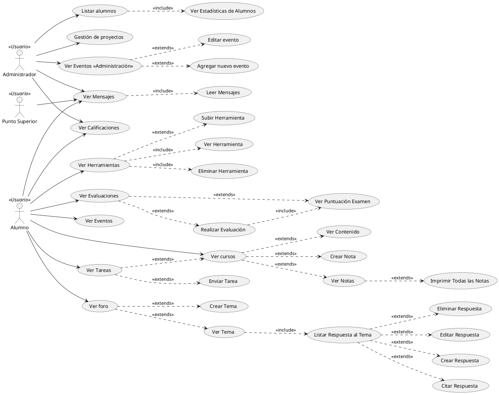

# Otecnya E-Learning

### Tabla Comparativa

|          Caso         |   Kampus Project  | Otecnya |
|-----------------------|-------------------|---------|
| Experiencia Mobile    | No                |         |
| SSL (Sitio Seguro)    | No                |         |
| Requiere Flash        | Si                |         |
| Responsiva            | Si (Parcialmente) |         |
| Offline               | No                |         |
| Porcentaje lighthouse | 48,75%            |         |

### Casos de uso Kampus Project

[](https://www.planttext.com/plantuml/svg/fLLBRjim4Dtp5DmrMIG7C08XXY4q1PAWIDBkMN7iJY6I0Zz6sZjrrIFaOXsAYaLPL1qq2yF0lFTc7cU6rBNpmlgWMlQ1RupUuiwn5hQUUyCjxhvxBj52uz5enbPhgL2ZyrP8OrVywkgB2yAYgIek71TI4QKDIfiv5iDizJbeIlmOEY1adg7pBdICdTrYj9L4nftpoykAdtq5oskAovVVpcD3T0by_Kg9kL0tRP1GLOoiy8iB4Xrb6e6FG4bU_kYOfBFc9vsnnoCnCMAz9bXN26-DDRFWax0WvjmRi5Oe1EqBOBsdW6Yekp07DwB5BHtq0BzwFmdUWNRYHo7b2FIjVeEYtfDpSrnWY5BFnvLeOZkhwfpcTugI1hhUMTZHS7I0lU7GyzCWuTc3beu6-SPKjSGuvd8EDZrXKjp293PT7vOFF_4tD5pBxuqNHOiJRWn4fYjI1wHdVbATHOMqF4RIGhVqMnREQj259GBAXHFtMvgxVm9LTfyn-qrUuYKWzIzTh0TmNQ2h9EYAPRgybSlCP0qdwApk2NdTKl_qkpB8zpb8lLsKi_nn62hgFOeXLkvppiv7NqezUM16IHO-dicIxD3B_z0-XczO41wRdJnuIVa0z9Jz4YD65tikBhCEfuqVbY7AwsUXG1UD5yh_IpqQkAP_-ah-1G00)

