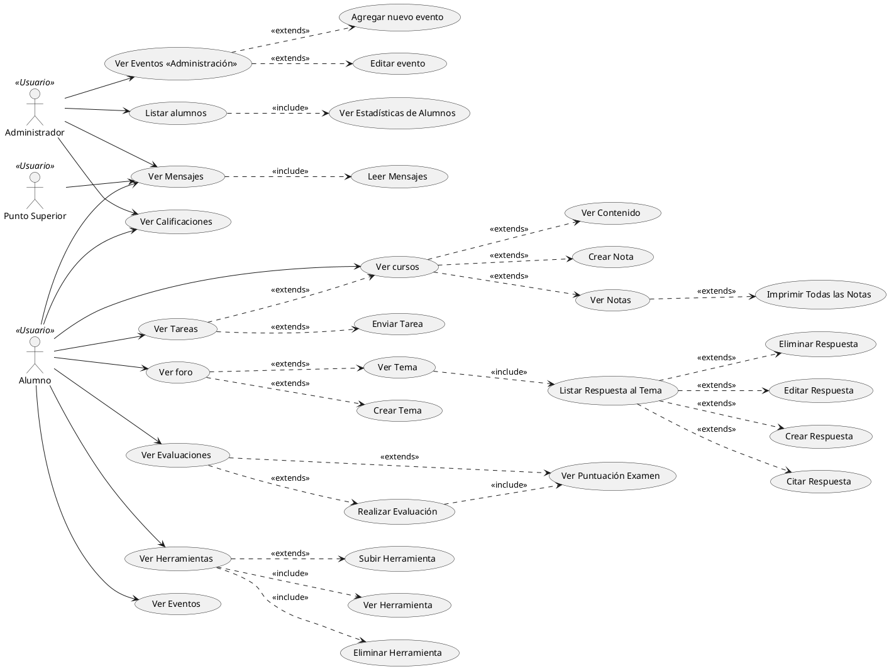

# Otecnya E-Learning

Casos de uso e-learning.

### Tabla Comparativa

|      Caso      | Kampus Project | Otecnya |
|----------------|----------------|---------|
| SSL            | No             |         |
| Requiere Flash | Si             |         |
|                |                |         |
|                |                |         |

### Casos de uso

